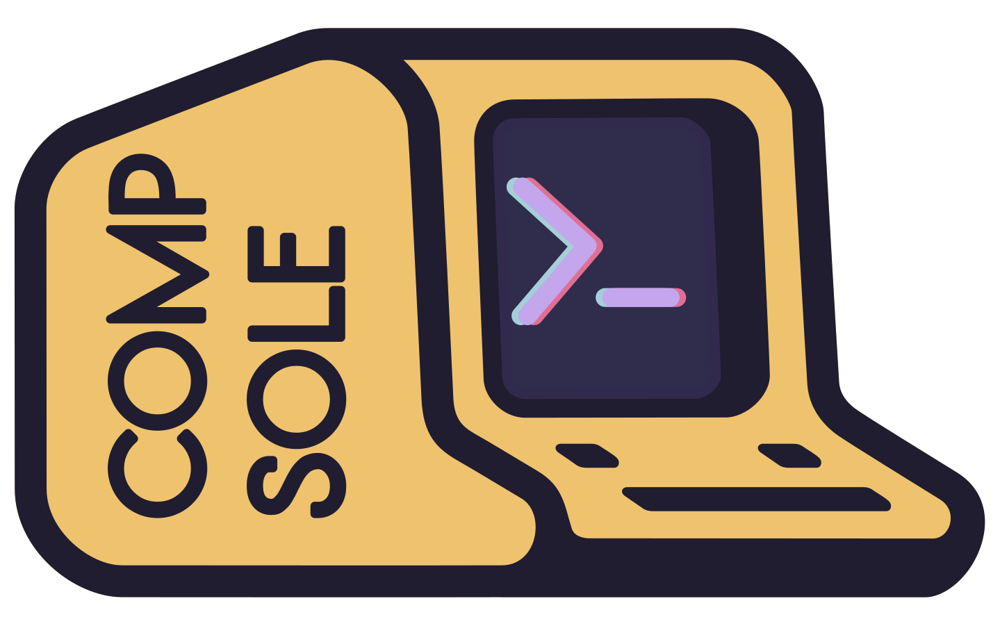

# compsole

[](https://github.com/BradHacker/compsole)
[](https://goreportcard.com/report/github.com/BradHacker/compsole)
[](https://github.com/BradHacker/compsole/blob/main/ui/package.json)
[](https://github.com/BradHacker/compsole/blob/main/LICENSE)

<p align="center">
  
</p>

## Introduction

This tool is designed to streamline the process of intereacting with virtual cybersecurity competition environments. While originally designed to support [ISTS](https://ists.io "Information Security Talent Search") and [IRSeC](https://irsec.club "Incident Response Security Competiton"), both are competitions run by the student club [RITSEC](https://ritsec.club "RIT's Student-run Computing Security Club"), Compsole is designed in a scalable manner in order to support many different virtual environments.

## Setup environment

Source the `.envrc` file to generate your `.env` file.

> _Note: this is necessary to run every time the environment is executed to prefill the environment variables_

```shell
$ source .envrc
```

## Production

Docker is used in production to host the frontend, backend, database, and Redis.

### Create your production `docker-compose.prod.yml`

Copy the contents of the [docker-compose.yml](./docker-compose.yml) to a new file `docker-compose.prod.yml`.

Set the environment variables as follows:

```yaml
# [...]
services:
  # [...]
  backend:
    # [...]
    environment:
      # Server
      - GRAPHQL_HOSTNAME=<fqdn of host>
      - CORS_ALLOWED_ORIGINS=http(s)://<fqdn of host>
      - PORT=:<port for graphql api (8080 by default)>
      - HTTPS_ENABLED=<true/false>
      - DEFAULT_ADMIN_USERNAME=<admin username>
      - DEFAULT_ADMIN_PASSWORD=<admin password>
      - GIN_MODE=release
      # Timeout in minutes
      - COOKIE_TIMEOUT=<suggested is 180 (or 3 hours)>
      # OAuth
      - GITLAB_KEY=<gitlab key for oauth (not supported yet)>
      - GITLAB_SECRET=<gitlab secret for oauth (not supported yet)>
      # Database
      - PG_URI=postgresql://<postgres user>:<postgres password>@db/compsole
      # - PG_CONN_LIMIT=
      # - PG_IDLE_LIMIT=
      # Redis
      - REDIS_URI=redis:6379
      - REDIS_PASSWORD=
      # [...]
    db:
      # [...]
      environment:
        - POSTGRES_USER=<postgres user>
        - POSTGRES_PASSWORD=<postgres password>
        - POSTGRES_DB=compsole
```

### Create React `.env` file

Copy the contents of the [ui/.env.example](./ui/.env.example) to a new file `ui/.env`

Set the environment variable as follows:

```
REACT_APP_SERVER_URL=http(s)://<fqdn of host>
REACT_APP_WS_URL=ws://fqdn of host>
```

### Bring up the production environment

```shell
$ docker compose -f docker-compose.prod.yml up -d
```

## Development

For development you can use [Vagrant](https://www.vagrantup.com/) to spin up a development environment.

After installing vagrant, just run:

```shell
# On your host
$ vagrant up
$ vagrant ssh

# Inside the VM
$ cd /vagrant
$ docker compose -f docker-compose.dev.yml up -d
$ export $(grep -v '^#' .env | xargs)
$ go run server.go
```
